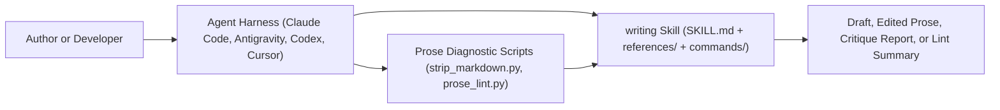
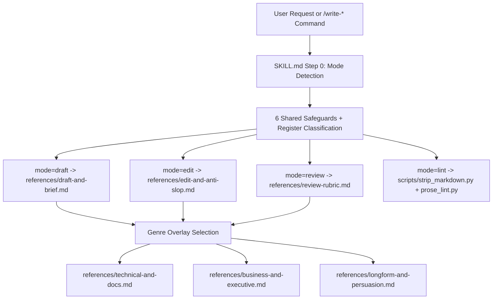
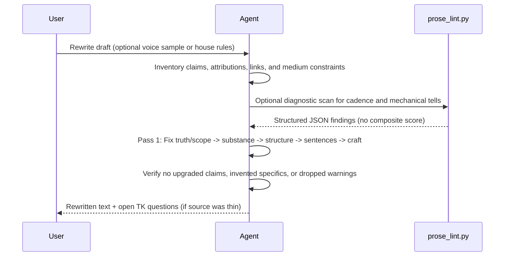

# System Diagrams

Last updated: 2026-11-17

## C4 Level 1: System Context

```mermaid
flowchart LR
    Author["Author or Developer"] --> Harness["Agent Harness (Claude Code, Antigravity, Codex, Cursor)"]
    Harness --> Skill["writing Skill (SKILL.md + references/ + commands/)"]
    Harness --> CLI["Prose Diagnostic Scripts (strip_markdown.py, prose_lint.py)"]
    Skill --> Output["Draft, Edited Prose, Critique Report, or Lint Summary"]
    CLI --> Skill
```

## C4 Level 2: Container and Routing Flow

```mermaid
flowchart TD
    Input["User Request or /write-* Command"] --> Step0["SKILL.md Step 0: Mode Detection"]
    Step0 --> Guard["6 Shared Safeguards + Register Classification"]
    Guard --> ModeDraft["mode=draft -> references/draft-and-brief.md"]
    Guard --> ModeEdit["mode=edit -> references/edit-and-anti-slop.md"]
    Guard --> ModeReview["mode=review -> references/review-rubric.md"]
    Guard --> ModeLint["mode=lint -> scripts/strip_markdown.py + prose_lint.py"]
    ModeDraft --> GenreRouter["Genre Overlay Selection"]
    ModeEdit --> GenreRouter
    ModeReview --> GenreRouter
    GenreRouter --> Tech["references/technical-and-docs.md"]
    GenreRouter --> Biz["references/business-and-executive.md"]
    GenreRouter --> Long["references/longform-and-persuasion.md"]
```

## Sequence: Single-Pass Edit Workflow (`mode=edit`)

```mermaid
sequenceDiagram
    participant User
    participant Agent
    participant Linter as prose_lint.py
    User->>Agent: Rewrite draft (optional voice sample or house rules)
    Agent->>Agent: Inventory claims, attributions, links, and medium constraints
    Agent->>Linter: Optional diagnostic scan for cadence and mechanical tells
    Linter-->>Agent: Structured JSON findings (no composite score)
    Agent->>Agent: Pass 1: Fix truth/scope -> substance -> structure -> sentences -> craft
    Agent->>Agent: Verify no upgraded claims, invented specifics, or dropped warnings
    Agent-->>User: Rewritten text + open TK questions (if source was thin)
```
